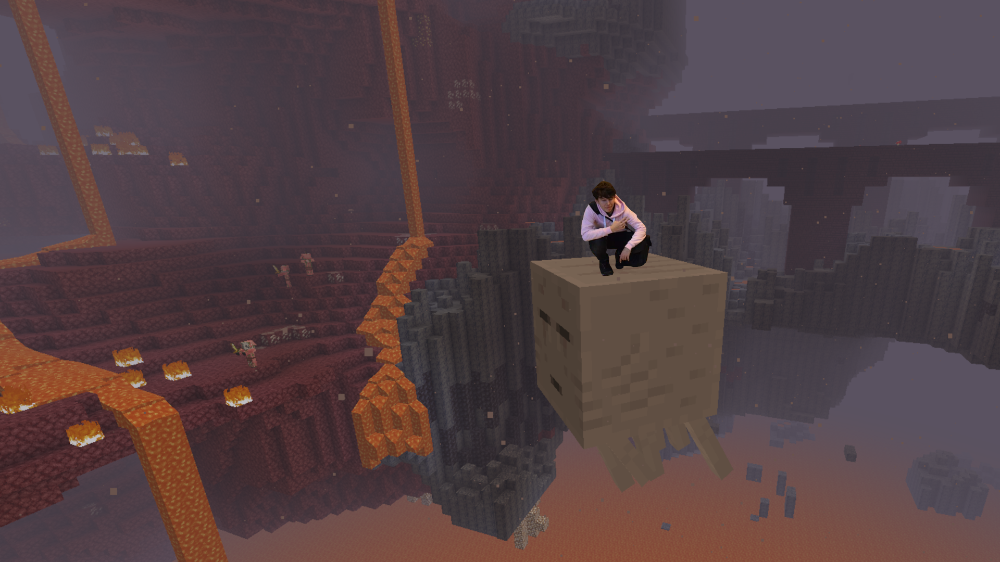

<h2>Hi! My name is Patryk, nice to meet you :)</h2>

<h4> Fav programming languages </h4>

<h4> Fav technologies: </h4>

  
  
  
  
  
  
  

[...aaand a cool JS diagramming library: JointJS](https://www.jointjs.com) 
<h2>Currently working on: <code>Anticipatory Networks editor (private)</code></h2>

<h2> Here are some of my past projects: </h2>

|||
| - | - |
| [🚢 Shipstorm](https://github.com/Stateczki/statki-online)  | Online game of ships (group project, React+Tailwind+Django). Functionality based on websockets using Django Channels. Unfortunately, I haven't hosted it yet, I'm planning to rewrite it in the future to fix some code issues. |
| [✂️ Salon Fryzjerski "Twój Styl"](https://github.com/razogarz/SalonRevamp) | Static page for beauty saloon (personal project, Astro+React+Tailwind). I focused on making it smooth and responsive for all kinds of screens, from the smallest mobile ones to wide monitors. It's hosted on Netlify [here](https://twojstylzywiec.netlify.app/) |
|  [Stowarzyszenie Ajentów i Franczyzobiorców](https://github.com/jeisenberger/Razem-Strona)  | Static webpage (group project, Html+Css+Django) |

<h4> ... the rest is probably either private, too small or unfinished  :^) </h4>

